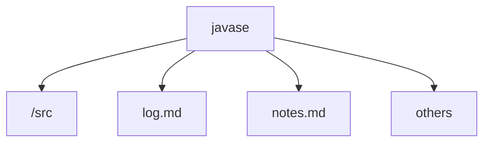

# Project Structure

```mermaid
graph TB
	javase --> /src
	javase --> log.md
	javase --> notes.md
	javase --> others
```

**/src:** code demos

**log.md:** a log used to record the progress of javase learning

**NOTES.md:** as its name suggests

