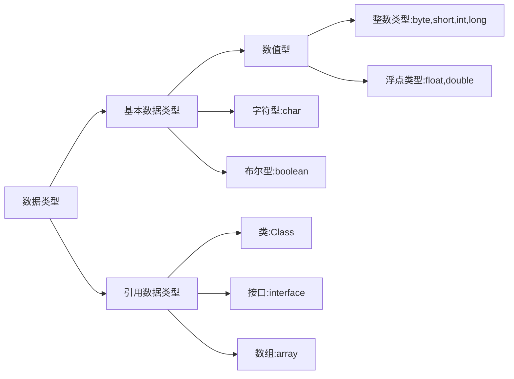
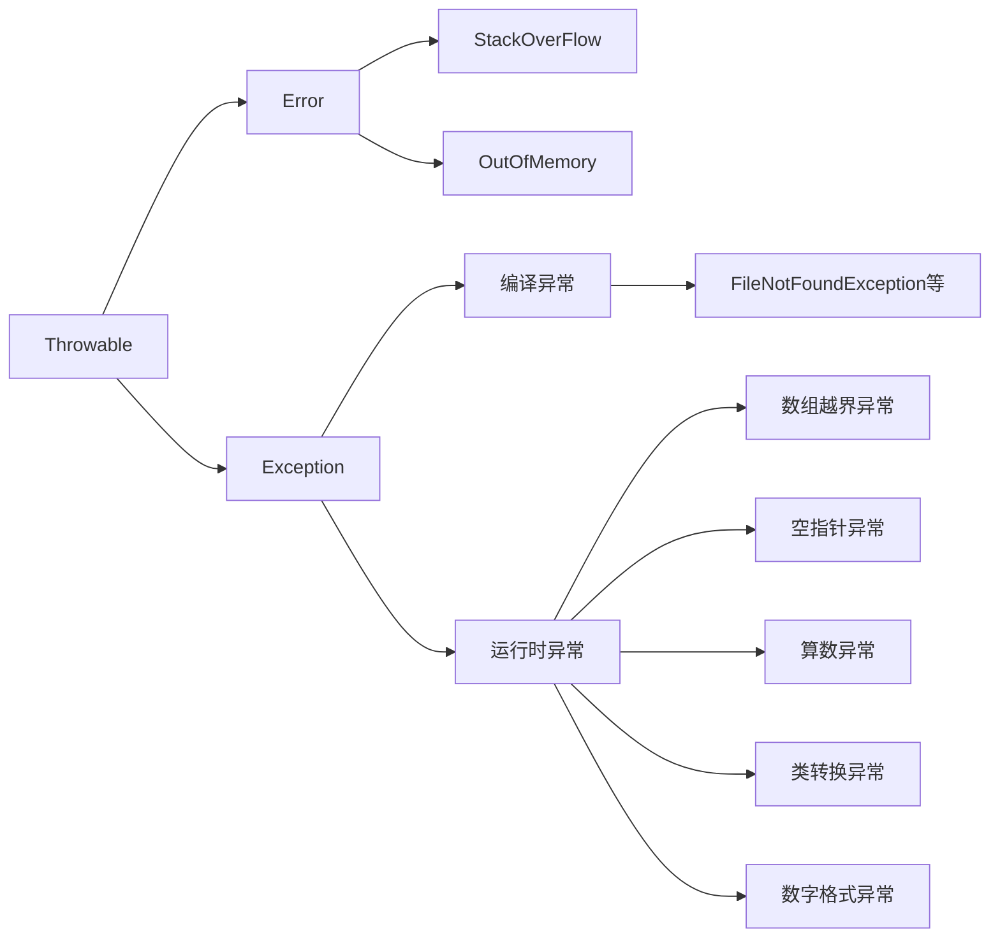
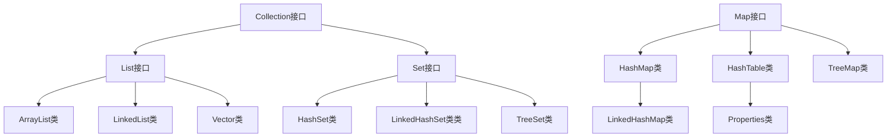

[toc]

# 基础

## 命名规范

- **项目**：全小写，中划线分割。spring-cloud
- **包**：全小写，无下划线。com.hsp.abc
- **类 & 接口**：大驼峰。TankShotGame
- **变量 & 方法**：小驼峰。stuName
- **常量**：全大写，下划线分割，用final static修饰。TAX_RATE

## 安装JDK配置环境变量

- PATH环境变量(必需)： java 文件通过 PATH 中设定的 JDK 目录找到编译命令进行编译
- CLASSPATH环境变量(必需)：指定类搜索路径，JVM通过CLASSPATH来寻找类
- JAVA_HOME环境变量(非必需)：即 JDK 安装的路径，idea等通过 JAVA_HOME 找到 JDK

## JDK/JRE/JVM


## IDEA目录

| 目录     | 意义                                                         |
| -------- | ------------------------------------------------------------ |
| .idea    | 存放项目的配置信息包括数据源，类库，项目字符编码，历史记录，版本控制信息等 |
| src      | 存放.java文件                                                |
| out      | 存放.class文件; .java文件编译生成.class文件                  |
| demo.iml | ①项目标识文件，缺少它就无法识别项目，与Eclipse的.project文件相同                                                                                ②是IDEA自己创建的模块文件，存储依赖/模块相关信息，比如Java组建/插件组建/Maven组建等                                                                ③在不同的设备上其也有差异，所以在管理项目的时候，.project和.iml文件都需要忽略掉 |

## 数据类型



## 键盘输入

```java
Scanner sc = new Scanner(System.in);
String str = sc.next();
char ch = sc.next().charAt(0);
int a = myScanner.nextInt();
```

## 数据类型转换

```java
//基本类型 -> String类型
int a = 100;
String str = a + "";
//String类型->基本类型
int a = Integer.parseInt(str);
float b = Float.parseFloat(str);
boolean c = Boolean.parseBoolean(str);
char d = str.charAt(0);
```

## 可变参数

- 可变参数本质是数组

  ```java
  public void test(int... nums) { System.out.println(nums.length); }
  ```

- 形参列表中：可变参数必须垫底，且最多只有1个可变参数

## 全局变量 & 局部变量

- 全局变量：属性，有初始值
- 局部变量：一般指方法中的变量，需初始化
- 两者可同名，访问时采用就近原则

## 获取类名

```java
new car().getClass().getSimpleName();//获取类名
new car().getClass();//获取包名及类名
```

# OOP

## 继承

- 父类又叫超类，基类；子类又叫派生类
- 子类继承父类的成员
- 当访问父类和子类的同名属性时，优先访问子类 -> 未找到则访问父类 -> 若父类为private则报错

## 访问修饰符

| 修饰符    | 子类 | 同包 | 不同包 |
| --------- | ---- | ---- | ------ |
| 默认      | ❌    | ✔    | ❌      |
| protected | ✔    | ✔    | ❌      |

## 构造器

<kbd>alt</kbd> + <kbd>G</kbd>

- 默认构造器为`Person(){}`
- 规则
  - 修饰符可有可无
  - 无返回类型
  - 方法名同类名
- 一旦定义了自己的构造器，将覆盖默认构造器（注意：不是重载！），除非显式地定义下

> **构造器调用细节**
>
> 1. 创建子类对象时肯定会调用构造父类的构造器，完成父类的初始化
>
> 2. 创建子类时，无论调用子类的which构造器，默认情况下必定会调用父类的无参构造器；
     >
     >    但如果父类的无参构造器没了（比如自己定义的构造器把默认的无参构造器覆盖了），则必须在子类的每个构造器中用super()
     去指定使用父类的which构造器完成父类的初始化，否则编译报错。验证了第1条规则。

## instanceof

- 判断对象的运行类型是否为XX类型或XX类型的子类型

## this

- this.data & this.func() ：调用本类中的属性和方法；若本类没有，则向上查找
- this(指定的本类其他构造器的参数列表)：调用本类其他构造器方法，且只能写在构造器中第一行

## super

- super.data & super.func() ：访问父类成员
- super(指定的父类构造器的参数列表)：访问父类的指定构造器，且只能写在构造器中第一行。因此super()与this()冲突

- 当父和子成员重名时，只能通过super访问父类属性和方法

## 重载

- 方法名相同
- 形参类型 | 个数 | 顺序 至少一样不同
- 访问修饰符 & 形参名 & 返回类型 无所谓

## 重写

- 方法名相同
- 参数列表相同
- 返回类型相同 或者 子类的返回类型是父类的返回类型的子类
- 访问修饰符相同 或 扩大

## 多态

- **编译类型 & 运行类型**

  - 左边 = 编译类型；右边 = 运行类型
  - 编译类型在指定引用对象时便已确定，不可变；运行类型可变

  ```java
  Animal animal = new Cat();
  //运行类型可变
  animal = new Dog();
  ```

- **向上转型**

  - 属性
    - 父和子都有：优先调用父类（[java的动态绑定机制 ](# java的动态绑定机制 )）
    - 子独有：不可调用⭐

  - 方法
    - 父和子都有：优先调用子类（[java的动态绑定机制 ](# java的动态绑定机制 )）
    - 子独有：不可调用⭐

  ```java
  // 向上转型:父类的引用指向子类的对象
  // 父类类型引用 = new 子类类型()
  Animal animal = new Cat();
  // 下面是错误示范
  animal.catchMouse();
  ```

- **向下转型**

  - 只能强转父类的引用，不能强转父类的对象

    ```java
    // 可强转：父类的引用为Cat对象
    Animal animal = new Cat();
    // 不可强转：父类的引用为自己的对象
    Animal animal = new Animal();
    ```

  - 向上转型后才能向下转型后

    ```java
    // 可转为Cat，但不可转为Dog
    Cat cat = (Cat) animal;
    // 由于向上转型后才能向下转型,因此,
    Animal animal = new Cat();
    Cat cat = (Cat) animal;
    // 等价于
    Cat cat = new cat();
    ```


- 多态数组：数组定义类型为父类类型，里面保存的实际类型为子类类型
- 多态参数：方法定义的形参类型为父类类型，实参类型允许为子类类型

## 动态绑定机制

- **前提是可以调用，不可调用见[向上转型](# 多态)**
- **调用**对象方法时：该方法会和该对象的内存地址/运行类型绑定
- **调用**对象属性时：无动态绑定机制，方法在哪一类声明，则调用哪一类的属性（可以理解为看编译类型❔）

## Object类

#### 所有类的根基类

- 当一个类未指定父类时，默认其父类为Object
- Object类中的方法（会用到的有）
  - equals() / toString() / getClass()/ hashCode()/ clone()/ finalize()/ wait()/ notify()/ notifyAll()等

#### hasnCode()

- 提高具有哈希结构的容器的效率
- 两个引用若指向的是同一对象，则哈希值也一样；不同对象则哈希值不一样

#### toString()

- 原型

  ```java
  public String toString() {
      return getClass().getName() + "@" + Integer.toHexString(hashCode());
  }
  // getClass().getName()：返回全类名，即包名+类名
  // toHexString():将长整型转换为十六进制字符串
  // hashCode():返回哈希编码
  ```

- 当输出一个对象时，会自动调用toString

#### equals与==区别

- ==
    - 基本数据类型：判断值相等（不要求类型严格相同）
    - 引用数据类型：只有指向同一个对象时才返回true（不可用于无父子关系的对象间的比较）
- equals()
    - 只能用于引用数据类型，与 == 的作用相同
    - 一般重写为“比较两个对象的实体内容是否相同”，如**String类**

[equals和==区别](# equals和==区别)


## static

**类变量 & 静态变量**

- 否则称为实例变量 / 普通变量 / 非静态变量
- 该类的所有实例对象共享该变量
- 在类加载时便已生成，且该变量可直接通过类调用

```java
public static int count = 0;
System.out.println(DEMO.count);
```

**静态方法 & 类方法**

- 静态方法不能使用与对象有关的关键字如this和super;
- 静态方法只能访问静态属性或静态方法;
- 普通方法既可访问普通方法又可访问静态方法;
- 总的来说就是创建时间的先后产生的问题。
- 当方法中不涉及任何与对象相关的成员时，常设计为静态方法;
- 或希望不用创建实例即可调用方法时，也涉及为静态方法，如Math类、工具类或一些常用的方法。

```java
public static void test() {}
System.out.println(DEMO.test());
```

## main

**public static void main(String[] args)**

- 参数说明：

  - main方法由jvm调用

  - public：dddd

  - static：jvm在调用main方法时无需创建对象

  - String[] args：从控制台接收的参数

- main方法可访问静态成员；不可访问非静态成员

## 类加载

类什么时候被加载？

1.创建对象实例时

2.调用static的属性或方法时

3.子类被加载时，父类也会被加载

注：每次运行时，不管有多少语句符合上述规则，每个类只会被加载一次

## 代码块

- 又称初始化块，属于类中的成员，但只有方法体和修饰符(修饰符要么不写要么写static)。

  根据是否写static划分为静态代码块/普通代码块；

  静态代码块只随着类的加载**执行1次**；而非静态代码块每创建一个对象便执行1次

  ```java
  // 静态代码块只执行1次；非静态代码块执行2次
  Cat cat1 = new Cat();
  Cat cat2 = new Cat();
  ```

- 创建一个对象时，一个类中成员的调用顺序为：

  1. static代码块和static属性初始化（两者优先级相同，当有不止一个时，按定义的顺续调用）
  2. 普通代码块和普通属性的初始化（同上）
  3. 构造器

- 创建一个子类对象时，调用顺序为：

  - 现有 静态代码块、静态属性初始化、普通代码块、普通属性初始化、构造器

  - 一.父类加载

    1. 父类的静态代码块 & 静态属性初始化

  - 二.子类加载

    2. 子类的静态代码块 & 静态属性初始化

  - 三.父类对象加载

    3. 父类的普通代码块 & 普通属性初始化

    4. 父类的构造器（理解：父类对象加载是子类对象加载的准备工作）

  - 四.子类对象加载

    5. 子类的普通代码块 & 普通属性初始化

    6. 子类的构造器

- 静态代码块只可访问静态成员；普通方法即可访问静态成员也可访问普通成员

## 单例模式

1. 构造器私有化
2. 在类内部创建静态对象
3. 向外暴露一个静态的访问方法，如 `getInstance`

**饿汉式**：

+ 可以不用，但不能没有，即类加载时便创建实例
+ 存在资源浪费问题

```java
class Cat {
    private String name;
    private static Cat cat = new Cat("tom");

    private Cat(String name) {
        this.name = name;
    }

    public static Cat getCat() {
        return cat;
}
```

**懒汉式**：

+ 用的时候再有，即使用时再创建实例
+ 存在线程安全问题

```java
class Cat {
	private String name;
    private static Cat cat;

    private Cat(String name) {
        this.name = name;
    }

    public static Cat getInstance() {
        if(cat == null) {
            cat = new Cat("Tom");
        }
        return cat;
    }
}
```

## final

- 用于当不希望 类被继承 / 方法被子类重写或覆盖(与重载没关系) / 属性被修改 / 局部变量被修改 / 形参被修改 时

- 一般用来修饰常量，如TAX_RATE

  - 而修饰常量时，常常和static连用，可以保证这个类的每个实例访问的是同一份常量；

    且内存不用重复申请和释放空间，提高效率

- 必须初始化，可在 定义时 / 构造器 / 代码块 中赋值

  - 但如果既是static又是final，则不能在构造器中赋值

- String,Interger等包装类均为final类

## abstract类

+ **含抽象方法的类即为抽象类**；抽象类中也**可有正常类**
+ **抽象方法无方法体，交由子类实现**
+ 不可被实例化
+ 当B继承抽象类A时，B必须**实现A的所有抽象方法**。除非B也是抽象类
+ 方法定义时，`abstract` 与 `private`、`final`、`static`相悖不共存

## interface

**<kbd>alt</kbd> + <kbd>enter</kbd>    实现接口中的方法**

+ 默认均为抽象方法，实现它的子类需**实现接口的所有抽象方法**

+ 接口中的方法有3种：默认、`default`、`static`

  ```java
  public void m1();
  public default void m2(){}
  public static void m3(){}
  ```

+ 不可被实例化

+ 接口中的方法访问修饰符**均为`public`，默认为`abstract`**

  ```java
  interface I1 {
      void m1();
      void m2();
  }
  ```

+ 一个类可实现多个接口

+ 接口中所有属性均为 **`public static final `**

+ 接口可以继承接口，注意是继承而不是实现

## 继承类 VS 实现接口

> 如小猴生来便会猴子爬树，这是继承；但如果想像鸟一样飞，鱼一样游就需要自己去学习，这就是实现

+ is a 和 has a

## 接口多态

+ [多态数组](src/interface_/PolyArray.java)

+ 多态传递

## 内部类

### 身份为局部变量

**局部内部类(有类名)**

+ 外部类与局部内部类中成员同名时，访问采取就近原则

  若要访问外部类的同名成员可使用 `外部类名.this.成员名`

**匿名内部类(无类名)**

+ ...... `外部类名.this.成员名`
+ [代码：基于接口的匿名内部类写法、基于类的匿名内部类写法、基于抽象类的匿名内部类写法（略写）、匿名内部类作为参数的使用](src/inner_class/AnonymousInnerClass.java)

### 身份为类成员

**成员内部类(无static修饰)**

+ ...... `外部类名.this.成员名`

**静态内部类(有static修饰)**

+ 只可访问外部类的静态成员
+ ...... `外部类名.成员名`(因为是静态类，this是对象实例的意思)
+ [代码：外部其他类访问成员内部类和静态内部类的两种方式](src/inner_class/StaticInnerClass.java)

# 枚举和注解

## [enum使用](src/enum_/EnumUse.java)

+ 使用enum关键字时将默认继承`enum`类，因此不可再继承其他类

## [enum常用方法](src/enum_/EnumMethod.java)

## @Override

+ 只可用于方法

+ 是否写该注解区别在于编译器是否会检查你是否正确重写了方法

## @Deprecated

+ 表示已过时，但仍可使用
+ 可修饰 方法、类、包、参数、字段

## @SuppressWarnings

+ 用来抑制警告
+ 作用范围与放置的位置相关

```java
// 忽略所有警告
@SuppressWarnings({"all"})
```

# 异常


<kbd>ctrl</kbd> + <kbd>alt</kbd> + <kbd>T</kbd>  + <kbd>6</kbd>

## 异常体系图

+ 编译异常须手动抛出
+ 运行时异常默认为throws



## 异常处理机制

+ **try-catch-finally**

  ```java
  /* 一般用法 */
  try {
      // 一旦异常跳过剩下的try块语句而进入catch块
  } catch(Execption e) {
      // 没有异常不执行catch块
      // 捕获异常后封装到e中，程序员自定义如何处理异常
      // 如：System.out.println(e.getMessage());
  } finally {
      // 无论是否有异常，均执行
      // 可不写
  }
  
  /* 多个catch */
  // 要求子类异常写在父类异常之前
  try {
  
  } catch (NullPointerException e) {
  
  } catch (ArithmeticException e) {
  
  } catch (Exception e) {
  
  }
  
  /* try-finally */
  ```

+ **throws**

  ```java
  // 将异常抛给调用者，由调用者决定是catch还是继续抛出
  // 当抛出到JVM时，JVM输出异常信息并退出程序
  public class demo {
      public static void main(String[] args) throws Exception{
      	 // 没有catch块默认为throws Exception
      }
  }
  ```

+ 典例：判断用户是否输入的是整数

  ```java
  while (true) {
      System.out.print("请输入整数：");
      try {
          str = sc.next();
          System.out.println("你输入的数是："+Integer.parseInt(str));
          break;
      } catch (Exception e) {
          System.out.print("你输入的不是整数！");
      }
  }
  ```

## 自定义异常(通过throw)

+ 一般继承运行时异常，编译异常太麻烦

```java
/* main() */
if ( age > 200) {throw new ageException("年龄不合理！");}
System.out.println("河里");
/* class */
class ageException extends RuntimeException {
    public ageException(String message) { super(message); }
}
```

## throw & throws

|        | 意义                         | 位置       | 后面跟的关键字                                       |      |
| ------ | ---------------------------- | ---------- | ---------------------------------------------------- | ---- |
| throws | 异常处理的一种方式           | 方法声明处 | 异常类型，如throws Exception                         |      |
| throw  | 用于手动生成异常对象的关键字 | 方法体内   | 异常对象，如throw new RuntimeException("参数不正确") |      |

# 常用类


## 包装类

+ 八大包装类为：Byte Short Integer Long Float Double Character Boolean

+ 装箱：基本数据类型 -> 包装类；反之为拆箱

  ```java
  /*jdk5前，为手动拆箱和装箱*/
  int i = 10;
  // 装箱方式一
  Integer integer = new Integer(i);
  // 装箱方式二
  Integer integer = Integer.valueof(i);
  // 拆箱
  int j = integer.intValue();
  
  /*jdk5后，为自动拆箱和装箱*/
  // 自动装箱
  Integer integer = i;
  // 自动拆箱
  int k = integer;
  ```

+ [包装类 <-> String类：Integer <-> String](src/CommonClass/IntToString.java)

+ [常用方法](src/CommonClass/CommonWrapperMethods.java)

## String & StringBuffer & StringBuilder

+ equals 与 == 的区别

+ String str = "abc"  与 String str = new String("abc")  的区别

  ```java
  String s1 = "aaa";
  String s2 = "bbb" + s1;
  // s2的内存布局与new String("aaabbb")一样，而非普通的String
  ```

  > [练习P467 -P470](https://www.bilibili.com/video/BV1fh411y7R8/?p=468&spm_id_from=pageDriver&vd_source=31a2c1c1b88c213ffcdc490b3eed651c)

+ [String常用方法](src/CommonClass/StringMethods.java)

  [StringBuffer常用方法](src/CommonClass/StringBufferMethods.java)

+ 三者的区别

  

## Math

+ [常用方法](src/CommonClass/MathMethod.java)

+ 随机数

  ```java
  int min = 31;
  int max = 37;
  int num = (int)(min + Math.random() * (max - min + 1));
  ```

## Arrays

+ [常用方法1](src/CommonClass/ArraysMethod01.java)

+ [常用方法2](src/CommonClass/ArraysMethod02.java)

## System

```java
long start = System.currentTimeMillis();
/* 执行的程序 */
long end = System.currentTimeMillis();
System.out.println("执行时间为：" + (end - start));
```

## BigInteger & BigDecimal

+ [BigInteger使用](src/CommonClass/BigInteger_.java)
+ [BigDecimal使用](src/CommonClass/BigDecimal_.java)

## Date & Calendar & LocalDateTime

推荐使用LocalDateTime，[用法](src/CommonClass/Date.java)

```java
/* 如何获取当前日期 */
//1.Date类
Date date=new Date();
        SimpleDateFormat sdf=new SimpleDateFormat("yyyy年MM月dd日 HH:mm:ss E");
        System.out.println(sdf.format(date));
//2.LocalDateTime类
        LocalDateTime ldt=LocalDateTime.now(); //LocalDate.now();//LocalTime.now()
        DateTimeFormatter dateTimeFormatter=DateTimeFormatter.ofPattern("yyyy-MM-dd HH:mm:ss");
        System.out.println(dateTimeFormatter.format(ldt));
```

# 集合




+ 集合分为 单列集合 & 双列集合
  + Collection接口的子接口List和Set为单列集合
  + Map接口的实现子类为双列集合，存放K-V

## Collection

+ [常用方法及遍历方式](src/Collection_/CollectionMethods.java)

  ```java
  List list = new ArrayList();
  list.add(new Book("wa","b",5));
  list.add("dsa");
  // 1.iterator迭代器遍历
  // 快捷键：itit
  Iterator iterator = list.iterator();
  while (iterator.hasNext()) {
      Object next = iterator.next();
      System.out.println(next);
  }
  // 2.for增强遍历
  // 快捷键：list.for或I或list.iter
  for(Object book:list){
      System.out.println(book);
  }
  // 3.普通for
  for (int i = 0; i < list.size(); i++) {
      System.out.println(list.get(i));
  }
  ```

## List

+ 可重复 / 有序(添加顺序与取出顺序一致)
+ 常用方法与Collection一致

**ArrayList**

+ ArrayList基本等同于Vector
+ 但线程不安全

**Vector**

+ 线程安全

## Set

+ 无序：添加和去除的顺序不一致 / 无索引 / 不允许重复元素 / 最多包含一个null
+ 常用方法与Collection一致

**HashSet**

+ 本质上是HashMap / 只能存放一个null / 不重复 / 无序
+ 底层为hashmap，只不过value为常量，机制：
    + 先获取要添加的的元素的hashCode()值
    + 对哈希表进行运算，得到的索引值即为要存在哈希表中的位置号
    + 如果该位置为空，直接存放；不为空则进行equals判断
        + 相等则不再添加
        + 不等则以链表的方式添加
+ [练习](src/Collection_/HashSetExercise.java)

**TreeSet**

+ 底层为TreeMap
+ [排序实例](src/Collection_/TreeSetMethods.java)

## Map

+ key不重复且最多只有一个null，value可重复且null的数量无限制

+ 无序

+ 常用String类作为key

+ 通过put添加，而非add

  ```java
  // 当重复添加时，value会被替换掉，而不是加不进去
  map.put("no1","aaa");
  map.put("no1","bbb");
  ```

+ [常用方法及遍历方式](src/Collection_/MapMethods.java)

+ 一个Map.Entry就是一个node。node包含一个键值对。entrySet包含所有的node，但并不是说entrySet的一个元素就是一个node，需要把该元素转换一下才是一个Map.Entry即node

**HashMap**

+ **使用频率最高**
+ 线程不安全

**HashTable**

+ 键和值都不能为null
+ 线程安全

**Properties**

+ HashTable子类，使用特点与HashTable类似
+ 可用于读取xxx.properties配置文件

**TreeMap**

+ TreeSet父类，使用与之类似
+ [排序示例](src/Collection_/TreeMapMethods.java)

## 集合选型

+ 单列：Collection接口
    + 允许重复：List
        + 增删多：LinkedList
        + 改查多：ArrayList
    + 不允许重复：Set
        + 无序：HashSet
        + 排序：TreeSet
        + 插入和取出顺序一致：LinkedHashSet
+ 双列：Map接口
  + 键无序：HashMap
  + 键排序：TreeMap
  + 见插入顺序和取出顺序一致：LinkedHashMap
  + 读取文件：Properties

## Collections工具类

+ [常用方法](src/Collection_/Collections_.java)

+ [集合练习题](src/Collection_/exercise)

# 泛型


+ 可用于接口，类，参数类型，方法返回类型
+ [使用实例](src/generic/GenericUse.java)
+ 泛型只能是引用类型，如只能是Integer而不能是int
+ 传递泛型时可以传该类型也可以传该类型的子类
+ 未指定泛型时默认为Object
+ 编译类型是泛型，由于子类也可被传递，因此需要用instanceof判断其运行类型

## 自定义泛型

+ [使用示例](src/generic/GenericCustomed.java)

## 继承和通配

+ 通配符就是?

+ <?>表示接收任意泛型
+ <? extends AA>表示接受AA及AA的所有子类
+ <? super AA>表示支持AA及AA的父类

# 线程


Thread类实现了Runnable

## 创建线程

+ **继承Thread**

  ```JAVA
  /* main() */
  Cat c1 = new Cat();
  c1.start();
  /* class */
  class Cat extends Thread {
      public void run() { /*业务逻辑*/}
  }
  ```

+ **实现Runnable**

  ```java
  /* main() */
  Cat cat = new Cat();
  Thread t1 = new Thread(cat);
  t1.start();
  /* class */
  class Cat implements Runnable {
      public void run() { /*业务逻辑*/ }
  }
  ```

+ 两种方式的异同

  + 同：start开启线程 -> start调用start0 -> start0由JVM执行（创建线程进入就绪态）

  + 异：实现Runnable更适合多个线程共享一个资源的情况

## 通知线程退出

```java
/* main() */
c1.setLoop(false);
/* class */
class cat implements Runnable{
	private boolean loop = true;
    public void setLoop(boolean loop) {this.loop = loop;}
    public void run() {while (loop)}    
}
```

## 线程常用方法

setName / setPriority / getPriority / sleep / start / run / interrupt

```java
/* main() */
c1.interrupt(); // 自己叫醒自己
/* run() */
try {
    System.out.println("开始休眠");
    Thread.sleep(1000);
} catch (InterruptedException e) {/*注意是InterruptedException*/
    System.out.println("打断");	// 睡眠时被打断则抛出异常
}
```

getName

```java
Thread.currentThread().getName();
```

yield / join

```java
/* main() */
Thread t1 = new Thread(new Cat());
t1.start();	// 启动c1并优先执行c1再执行主线程
t1.join();
```

## 守护线程

+ 用户线程：也叫工作线程
+ 守护线程：服务于用户线程，当所有用户线程结束时才结束。如垃圾回收机制。

```java
/* main() */
Thread t1 = new Thread(new Cat());
t1.setDaemon(true);
t1.start();
```

## 线程状态


```java
Thread t1 = new Thread(new Cat());
if(Thread.State.TERMINATED != t1.getState()){}
```

## 线程同步（超卖问题）

+ **synchronized**

+ 疑惑分析

  1. 锁加到run方法：1号窗口直接把票卖完

  1. 锁加到run方法，run调用sell，原先run中的代码全部移到sell：1号窗口直接把票卖完

  1. 锁加到sell方法，run调用sell，原先run中的代码全部移到sell：1号窗口直接把票卖完

  1. 锁加到sell方法，run调用sell，循环中的代码移到sell：正常

     如何理解：while循环就相当于工作，进入while循环才相当于开始营业，所以当while也被锁起来时，只有一个窗口在工作

     所以，锁必须不能加到while上！！！

     所以，只把访问了临界资源的代码锁起来，其它尽量不锁！！！

## 互斥锁（synchronized）

可同步方法 或 同步代码块。优先选择同步代码块。

```java
// 1.非静态方法加锁
// 相当于给此类的所有对象加锁
// 此时，代码块锁对象为 this
class Cat implements Runnable {
  public synchronized void m1() {
  }

  public void m2() {
    synchronized (this) { /*临界区*/ }
  }
}

// 2.静态方法加锁
// 相当于给此类加锁
// 此时，代码块锁对象为 当前类.class
class Cat implements Runnable {
  public synchronized static void m() {
  }

  public void m2() {
    synchronized (Cat.class) { /*临界区*/ }
  }
}

// 要求加锁的对象必为同一个！如下为错误示范
class Cat extends Thread {
  public void m() {
    synchronized (this) { /*临界区*/ }
  }
} 
```

## 释放锁

+ 代码块执行完毕。正常拉完
+ return或break。拉到一半经理叫改bug
+ error或exception。拉到一半发现没带纸
+ wait。拉到一半发现没感觉，需要酝酿一下

下面不会释放锁

+ sleep 或 yield

# IO流


## 文件

+ [创建文件](src\file\FileCreate.java)

+ 常用方法

  ```java
  getName();
  getAbsolutePath();
  getParent();
  getlength();	// 单位为字节
  exists();	// 返回布尔值
  isFile();	
  isDirectory();
  mkdir();	// 创建一级目录，返回布尔值
  mkdirs();	// 创建多级目录，返回布尔值
  delete();	// 删除空目录或文件，返回布尔值
  ```

## IO流类图


## FileInputStream & FileOutputStream

+ [FileInputStream](src\IOStream\FileInputStream_.java)
+ [FileOutputStream](src\IOStream\FileOutputStream_.java)

## FileReader & FileWriter

+ [FileReader](src\IOStream\FileReader_.java)
+ [FileWriter](src\IOStream\FileWriter_.java)

+ FileWriter使用后必须要close或flush，否则写入失败

## 节点流 / 包装流

+ 节点流：从特定数据源读写数据，如FileReader、FilrWriter
+ 包装流：又称处理流，包装了各种节点流，如BufferedWriter、BufferedReader
+ 序列化：在保存数据时，既保存数值又保存数据类型
+ 反序列化：在恢复数据时，既恢复数值又恢复数据类型
+ 纯文本数据字符流效率更高，且可以有效解决中文乱码问题；
+ 二进制文件使用字节流

## BufferedReader & BufferedWriter ***

+ [BufferedReader](src/iostream/BufferedReader_.java)
+ [BufferedWriter](src/iostream/BufferedWriter_.java)

## BufferedInputStream & BufferedOutputStream

## ObjectInputStream & ObjectOutputStream

+ [ObjectInputStream使用实例](src/iostream/ObjectInputStream_.java)
+ [ObjectOutputStream使用实例](src/iostream/ObjectOutputStream_.java)
+ [细节](src/iostream/Dog.java)

## InputStreamReader & OutputStreamWriter

+ 可用来解决字符乱码问题
+ [BufferedReader使用实例](src/iostream/BufferedReader_.java)

## PrintStream

+ 字节流

+ [使用](src/iostream/PrintStream_.java)

## PrintWriter

+ 字符流
+ [使用](src/iostream/PrintWriter_.java)

## System.in & System.out

|            | 编译类型    | 运行类型            | 数据源 |
| ---------- | ----------- | ------------------- | ------ |
| System.in  | InputStream | BufferedInputStream | 键盘   |
| System.out | PrintStream | PrintStream         | 显示器 |

## Properties

+ [使用](src/iostream/Properties_.java)

# 反射


## 反射机制

+ [入门](src/reflection/intro.java)

**反射相关类**

+ java.lang.Class：代表一个类，Class对象表示某个类加载后在堆中创建的对象
+ java.lang.reflect.Method：类的方法
+ java.lang.reflect.Field：类的成员变量
+ java.lang.reflect.Constructor：类的构造器

**反射作用**

+ 在运行时判断任意一个对象所属的类
+ 在运行时构造任意一个类所的对象
+ 在运行时构造任意一个类的所有成员变量和方法
+ 在运行时调用任意一个对象的成员变量和方法
+ 生成动态代理

**反射调用性能优化**

+ 优点：可以动态的创建和使用对象（框架底层核心），使用灵活
+ 缺点：使用反射基本是解释执行，对执行速度有影响
+ 通过setAccessible方法设置参数值为true取消访问权限检查，提高效率；默认为false
  + method、field、constructor均有此方法

## Class类

### 特点

+ Class类对象是系统创建（类加载器ClassLoader的loadClass方法）的，而不是new出来的

+ 一个类的Class对象内存中只能有一份。

  > 比如new Cat()后，类便被加载了再调用 Class.forName(classpath) 则直接取现成的了。
  >
  > 可通过两个Class对象的hashCode的值发现是同一个Class对象

+ 每个类的实例都会知道自己是Class类对象生成的

  > 这也是为什么实力可以通过getClass方法得知自己的运行类型的原因

+ 通过Class对象可以获得类的一系列结构，通过API

+ Class对象存放在堆

+ 类的字节码文件即Cat.class文件的二进制数据，是放在方法区的

    + 也有人将此二进制数据称为元数据

### 常用方法

+ [常用方法](src/reflection/CommonMethods.java)

### 获得Class对象的四种方式

+ [示例](src/reflection/GetClass.java)

| 阶段       | 前提                                                   | 应用场景                             |
| ---------- | ------------------------------------------------------ | ------------------------------------ |
| 编译阶段   | 已知全类名如“`java.lang.Cat`”，通过`Class.forName`获取 | 配置文件，读取类全路径，加载类       |
| 类加载阶段 | 已知具体的类如Person，通过`Person.class`获取           | 参数传递如通过反射得到对应构造器对象 |
| 运行阶段   | 已知某个类的实例，通过`o.getClass()`获取               | 通过创建好的对象获取Class对象        |
| 类加载器   | 略                                                     | 略                                   |

## 类加载

+ 静态加载：编译时加载相关的类，无论是否使用该类，没有则报错。依赖性过高
+ 动态加载：运行时加载相关的类，运行时不用该类则不报错，降低了依赖性
+ 反射是动态加载
+ 类加载时机：new、static、子类被加载时、反射。
    + 其中，只有反射是动态加载

## 反射获取类的结构信息

+ [Constructor](src/reflection/CreateInstance.java)
+ [Field](src/reflection/AccessProperty.java)
+ [Method](src/reflection/AccessMethod.java)

# MySQL

## sql语句分类

+ DDL：create
+ DML：insert、update、delete
+ DQL：select
+ DCL：grant、revoke

## 备份和恢复数据库

+ 备份数据库

```bash
# root为用户名；将db01和db02数据库的创建插入等语句存入到bak.sql文件中
mysqldump -u root -p -B db01 db02 >d:\\mysql\\bak.sql
# 备份表
mysqldump -u root -p -B db01 table1 table2 >d:\\mysql\\bak.sql
```

+ 恢复数据库

```bash
source d:\\mysql\\bak.sql
```

## 数据类型

**decimal[M,D]**

+ M表该数的总位数，D表示该数的小数位数
+ M最大为65，D最大为30
+ M缺省为10，D缺省为0

**char(n) & varchar(n)**

+ char的n最大值为255；varchar的n最大值为65535；
+ n表示字符数，无论英文字母还是汉字，都是1个字符
+ char在值小于10时，会自动填充空格；而varchar则值为啥就存啥，只添加一个结束符
+ char效率更高，因为定长，以空间换时间；varchar则相反

**date & datetime & timestamp**

## 函数

+ 统计函数
+ 字符串函数
+ 数学函数
+ 日期函数
+ 加密函数和系统函数
+ 流程控制函数

> [0758_韩顺平Java_统计函数_哔哩哔哩_bilibili](https://www.bilibili.com/video/BV1fh411y7R8?p=759&vd_source=31a2c1c1b88c213ffcdc490b3eed651c)

## 索引

+ 以空间换时间，提升select效率，减低增删改效率
+ 哪些列适合建立索引？
    + 较频繁的作为查询条件
    + 唯一性太差不建议建立
    + 更新频繁的不建议
    + 不会出现在where中的不建议

## 事务

+ 隔离级别定义了事务间的隔离程度

+ 脏读：事务A读到了事务B未提交的修改

+ 不可重复读：设事务A中有多次查询，由于事务B提交的事务中的update操作，导致每次查询的结果集都不一样

+ 幻读：设事务A中有多次查询，由于事务B提交的事务中的insert//delete操作，导致每次查询的结果集都不一样

+ 隔离级别（4种）

  | 隔离级别                             | 脏读 | 不可重复读/幻读 | 加锁读 |
    | ------------------------------------ | ---- | --------------- | ------ |
  | 读未提交 read uncommited             | √    | √               | 不加锁 |
  | 读已提交 read committed              | ×    | √               | 不加锁 |
  | 可重复读 repeatable read（默认情况） | ×    | ×               | 不加锁 |
  | 可串行化 Serializable                | ×    | ×               | 加锁   |

## 存储引擎

+ innodb：支持事务和外键、行级锁
+ myisam：添加速度快、不支持外键和事务、表级锁
+ memory：数据储存在内存而无需读取磁盘所以执行速度快，但一关闭mysql服务，则数据丢失
+ 存储引擎的选择
    + 无需事务，处理的是基本的crud操作，选myisam
    + 事务，选innodb
    + 经常变化的数据如用户的在线状态等可以用memory

## 用户权限管理

```MYSQL
/*用户管理*/
CREATE USER 'guest'@'localhost' identified by '123456';
DROP USER 'guest'@'localhost';
set password = password('132456');#修改自己密码
set password for 'guest'@'localhost' = password('132456');#修改别人密码

/*权限管理*/
GRANT ALL ON *.* TO 'guest'@'localhost';#授予该用户所有数据库的所有对象的所有权限
REVOKE ALL ON *.* FROM 'guest'@'localhost';
```

# 正则表达式


## 底层原理

+ [用法示例及底层原理](src/regexp/RegTheory.java)

## 基本语法

元字符分为以下几类：

+ 转义符

  java中的转义符为 \\\

+ 限定符

  | 符号  | 含义    |
    | ----- | ------- |
  | *     | 0-n次   |
  | +     | 1-n次   |
  | ?     | 0-1次   |
  | {n}   | n次     |
  | {n,}  | 至少n次 |
  | {n,m} | n-m次   |

  注：java匹配默认贪婪匹配，尽可能匹配多的

  但当？跟在+ * ? {n,} {n,m}后时，匹配模式被更改为非贪心的

+ 选择匹配符

  | 符号 | 含义 |
    | ---- | ---- |
  | \|   | 或   |

+ 分组组合

  1个括号里的内容算一个分组

  | 常用分组构造形式  | 说明                                                         |
      | ----------------- | ------------------------------------------------------------ |
  | (pattern)         | 非命名捕获。捕获匹配的字符串。给匹配到的整个字符串编号为0，其它编号按括号的顺序 |
  | (?<name\>pattern) | [使用示例](src/regexp/Group.java)                            |

+ 反向引用符

  在正则表达式内部用\\\1，在外部用$1。[例](src/regexp/Exercise01.java)

  | 例子              | 正则表达式    |
      | ----------------- | ------------- |
  | 5个连续的相同数字 | (\\\d)\\\1{4} |

+ 字符匹配符

  | 符号 | 含义                               | 示例   | 解释                                            |
      | ---- | ---------------------------------- | ------ | ----------------------------------------------- |
  | []   | 可接受的字符列表                   | [ABC]  | A/B/C中任意一个都接收                           |
  | [^]  | 不接受的字符列表                   | [^ABC] | 除A/B/C外，所有字符都接收，包括数字和特殊符号   |
  | -    | 连字符                             | A-Z    | A到Z的所有大写字母                              |
  | .    | 匹配除\n外的任意一个字符           | a..b   | a开头b结尾中间包括两个任意字符的长度为4的字符串 |
  | \\\d | [0-9]                              |        |                                                 |
  | \\\D | [^0-9]                             |        |                                                 |
  | \\\w | [A-Za-z0-9_]                       |        |                                                 |
  | \\\W | [^A-Za-z0-9]                       |        |                                                 |
  | \\\s | 匹配任何空白字符，如制表符、空格等 |        |                                                 |
  | \\\S | 匹配任何非空白字符                 |        |                                                 |

  ```java
  /* 如何不区分大小写？*/
  // (?i)abc表示abc都不区分大小写
  // a(?i)bc表示bc不区分大小写
  // a((?i)b)c表示只有b不区分大小写
  // 或如下
  Pattern pattern = Pattern.compile(regStr, Pattern.CASE_INSENSITIVE);
  ```

+ 定位符

  | 符号 | 含义                   | 示例    | 说明                              |
    | ---- | ---------------------- | ------- | --------------------------------- |
  | ^    | 指定起始字符           | ^[0-9]  |                                   |
  | $    | 指定结束字符           | [0-9]$  |                                   |
  | \\\b | 匹配目标字符串的边界   | liu\\\b | liuguoqing **liu** guoqing**liu** |
  | \B   | 匹配目标字符串的非边界 | liu\\\B | **liu**guoqing liu guoqingliu     |

  边界：遇到空格或结束算一个边界

## Pattern和Matcher类常用方法

+ [示例](src/regexp/CommonMethods.java)

## 经典案例

+ [结巴去重](src/regexp/Exercise01.java)

# JAVA8新特性


